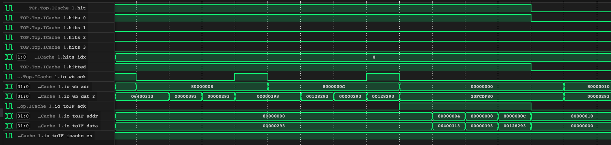

# 五级流水线 RISC-V 处理器

计14 彭梓健，计16 尚子智，计14 王博文

## 项目介绍

在本项目中，我们基于 SpinalHDL + Verilator 框架实现了一款五级流水线 RISC-V 32 位处理器，能够运行 uCore 操作系统，并支持丰富的性能优化扩展与外设扩展。


如上图所示，我们的 CPU 能够成功运行 uCore 操作系统并在约 10 分钟的时间内通过 matrix。

## 环境

- [Scala](https://www.scala-lang.org) 2.12.8
- [Mill](https://mill-build.com) 0.11.5
- [SpinalHDL](https://spinalhdl.github.io/SpinalDoc-RTD) 1.9.4
- [Verilator](https://www.veripool.org/verilator/) 5.018
- [Vivado](https://www.xilinx.com/products/design-tools/vivado.html) 2019.2

## 使用

运行 `mill r` 生成 SystemVerilog 文件，然后使用 Vivado 打开 `thinpad_top.xpr` 即可进行综合。

你可以通过 `install_hook.sh` 安装一个在每次提交前自动运行 `mill r` 的 git 钩子。

运行 `mill t {testcase}` 进行测试，其中 `{testcase}` 为测试用例的名称，测试用例位于 `spinal/tb` 目录下。

以下测试用例也许可以帮助你进行调试：

- `Lab6`: 小实验 6 的测试用例。
- `Instr19`: 运行基础监控程序所需的 19 条指令测试用例。
- `Rv32i`: 完整 RV32I 指令集测试用例。
- `Extra`: 额外指令测试用例。注意，每组分配到的额外指令不同，本组为 ANDN, CLZ, PACK。
- `Zicsr`: 测试 Zicsr 扩展指令集及 CSR 读写。
- `Exception`: 测试中断异常。
- `Supervisor`: 测试中断异常版本监控程序，包括启动、跳转以及环境调用。
- `SupervisorPaging`: 测试页表版本监控程序，内容与 `Supervisor` 相同。
- `UCore`: 测试 uCore 启动流程。注意，为了加速测试，我们使用了物理内存空间缩减版的 uCore。同时，我们对波形采样进行了限制，只有在出错位置前一定周期内的波形才会被采样，因此需要根据实际需求定义仿真出错条件。

运行测试后，你可以在 `simWorkspace/Top/test.vcd` 中找到仿真波形，若测试用例中启用了 Tracer，你还可以在 `simWorkspace/trace.txt` 中找到执行的每条指令的 PC 及其对寄存器堆的写入，你可以利用这些信息与已知正确的实现进行比对快速定位出错位置。

## CPU 结构图


## 功能实现

实现了 RV32I 指令集中除 FENCE 外的全部指令，Zicsr、Zifencei 扩展指令集，以及特权态支持和虚拟内存支持所需的 MRET、SRET 及 SFENCE.VMA 指令。此外，还实现了 B 扩展指令集中 ANDN，CLZ 和 PACK 三条指令。

支持 M/S/U 三种特权态以及中断异常处理。支持虚拟内存。支持计时器。

实现了分支预测、缓存与 TLB 等性能提升方面的扩展，支持 Flash 以及 VGA 外设。

## 模块功能

### ALU

一个普通的 ALU。

### RegFile

一个普通的寄存器堆。写优先，即同时读写时，读取的内容将返回正在写入的内容。

### CSR

一个普通的控制状态寄存器堆，在 MEM 阶段处理对 CSR 的访问。每个 CSR 有两套接口：

- **地址访问。** 这套接口用于 Zicsr 指令通过 CSR 地址来读写寄存器。
- **控制访问。** 这套接口用于 CPU 直接读取和修改 CSR 的内容，并以此决定 CPU 执行状态。

### Timer

一个普通的计时器。可以通过 rdtime & rdtimeh 指令访问计数，或通过映射到的内存地址读写计数或设置计时。映射的内存地址如下：

|**地址**|**说明**|
|---|---|
|0x0200BFF8|mtime，64 位，可读写。表示当前时间|
|0x02004000|mtimecmp，64 位，可读写。表示下次时钟中断时间|

当 mtime ≥ mtimecmp 时，触发时钟中断。

### TrapCommit

陷入提交模块。我们选择在 WB 阶段处理陷入，当流水线中存在带有陷入信号的指令时，冲刷该指令后的指令以确保精确异常，同时阻塞 IF 阶段的取指。当带有陷入信号的指令到达 WB 阶段时，向 TrapCommit 模块进行陷入的提交，根据陷入的原因、当前特权态、CSR 状态等进行陷入处理，并跳转到新的 PC 重新开始取指。

为了实现方便，我们将 MRET/SRET 指令实现为触发一种自定义异常，这样就可以与 ECALL 和 EBREAK 进行类似的处理。

在 WB 阶段处理陷入主要有以下好处：

- 不需要顾及副作用。由于陷入指令到达 WB 阶段时，它一定是流水线中唯一的指令，因此不需要考虑其他指令可能产生的副作用。
- 不需要提前执行某些操作。例如，若在 EXE 阶段处理陷入，需要先等待 MEM 阶段确认没有缺页异常才能继续处理。

### PageTable

实现了 Sv32 的两级页表，以下讨论不考虑 TLB。 

为了实现一次访存，CPU需要

+ **获取一级页表：** 通过 satp 寄存器的 20位PPN基址与10位的虚拟地址 PPN_0 拼接后补0作为访存地址，访问物理内存得到一级页表；
+ **获取二级页表：** 通过 一级页表 指定的基址 PPN 拼接上 10位的虚拟地址 PPN_1 拼接后补0作为访存地址，访问物理内存得到二级页表；
+ **获取物理地址：** 通过 二级页表 指定的基址 PPN 拼接上虚拟地址12位VPO，得到实际地址。

在这个过程中可能出现异常并报 Page fault 的情况有：

+ PTE 无效
+ 在 S 模式下，如果访问类型是取指，并且页面表项具有用户权限，阻止用户代码执行
+ 在 U 模式下，阻止用户访问不具有用户权限的页面
+ 在 S 模式下，当 mstatus寄存器的 SUM 等于 0 时, 阻止对具有用户权限的页面的访问
+ 在存储访问时，阻止对不具有写权限的页面的访问
+ 在取指令访问时，阻止对不具有执行权限的页面的访问
+ 存储页面不为脏页或者不具有访问权限
+ 页面未对齐

### TLB
实现了64项直接映射的TLB，当TLB hit时可立即读取出对应的页表表项。

TLB表项的格式为：

|**Valid**|**VPN**|**PTE**|
|---|---|---|
|1 bit|20 bits|32 bits|

TLB索引取访问地址的 [12, 17] 。

### BPU
实现了 32 表项直接映射的分支预测，每个表项形如：

|**BHT**|**TAG**|**Addr**|
|---|---|---|
|2 bits|32 bits|32 bits|

其中，BHT为2位的预测位，当 BHT >= 2时，预测会跳转；TAG为32位的PC，用于与当前PC比对；Addr为跳转的地址

为了方便，实现的时候考虑的跳转指令不包括 jalr。

BHT 的更新逻辑如下：

|**BHT**|**EXE处是否跳转**|**NEXT**|
|---|---|---|
|0|是|1|
|0|否|0|
|1|是|2|
|1|否|0|
|2|是|3|
|2|否|1|
|3|是|3|
|3|否|2|

特别地，当 EXE 的跳转指令 PC 的 index 对应的表项的 TAG 与 PC 不符时，设置该表项的 BHT 为 0（不跳转）或者 1（跳转）。

### ICache

实现了指令缓存，采用了四路组相联的缓存结构，每行存储 128 bits 的数据，使用 LRU 替换策略。

#### 缓存结构
对于每个缓存行（CacheLine），采用如下结构：

|**Valid**|**Tag**|**Data**|**Counter**|
|---|---|---|---|
|1 bit|25 bits|128 bits|2 bits|

其中，Valid 位为有效位（高信号有效），Tag 为标记位，Data 位存储了连续的 4 个 words（即 128 bits）的数据，同时添加了 Counter 位作为 LRU 替换策略中的计数器。

#### 算法思路

**查找：**

1. 在 IF 阶段，当 CPU 每次发送一个读 PC 请求的时候，直接将此 pc 值送入 ICache
2. 计算请求 pc 值的 index 与 tag，对比 4 个 CacheSet 的 index 行：
    - 是否有效 （ valid 为 1 ）
    - tag 是否与 pc 的 tag 相等
3. 如果同时满足两个条件，则 hit，计算 Data 字段偏移，更新 CacheLine 的 Counter 值，并返回 ICache 中存储的 PC 值

**读取更新：**

1. 若缓存没有命中，则由 ICache 向 Wishbone 总线发送请求，连续请求 4 个 words
2. 若 4 个 CacheSet 对应的 index 行存在 empty line，则将新数据写入 empty line
3. 若所有 CacheSet 对应的 index 行都已经满了，则选择 Counter 值最大的进行替换

**替换策略：**

LRU 替换算法在每次选择被淘汰掉的缓存块是依据上次访问的时间进行的，具体来讲我们如下维护每个 CacheLine 的 Counter 值：
1. 针对每次查找更新对应 CacheLine 的 Counter 值，若命中了某个 Set 的 CacheLine，则将此 CacheLine 的 Counter 值置为0
2. 对于其他 Set 的 CacheLine
    - 若其 Counter 值小于命中 CacheLine 的 Counter 值，则将其 Counter 值加一
    - 若其 Counter 值大于命中 CacheLine 的 Counter 值，保持其 Counter 值不变
如此便维护了一个简易的 LRU Counter，在每次选择牺牲块时，只需要选择 Counter 值最大的进行替换操作即可

### Dcache

实现了数据缓存，WriteThrough 写回策略，采用了四路组相联的缓存结构，每行存储 128 bits 的数据，使用 LRU 替换策略。

#### 缓存结构

与 ICache 相同。

#### 算法思路

**查找：**
与 ICache 相同。

**写入更新：**
在 Dcache 的写入更新过程中，需要进行 Dcache 和 DM 两部分的数据更新，且需要额外考虑数据写入时候的使能问题

1. Dcache 更新
    - 如果是 sw 命令，则直接根据对应的 offset 写入 Data 字段对应的 word 即可
    - 如果是 sb 命令，则需要计算写入的字节使能问题，更新对应的 byte

2. DM 更新

    向 Wishbone 发送对应的请求即可

**读取更新与替换策略：**

与 ICache 相同。

## 拓展功能

### 中断异常

我们将陷入（中断和异常的总称）信号添加到流水线信号中，包括如下信号：

+ trap: 当前指令是否触发陷入。
+ epc: 触发陷入的指令的 PC。
+ cause: 陷入号。
+ tval: 部分陷入需要的额外信息，例如对于非法指令异常，tval 被设置为指令的值。

目前，IF、ID 和 MEM 三个阶段可能产生陷入。

- IF/MEM：开启虚拟内存时，可能发生缺页异常。
- IF: 当时钟中断触发条件满足时，从 IF 取出的指令将会带上中断信号。
- ID：当指令不能被译码为已实现的指令时，触发非法指令异常。当指令为 ECALL、EBREAK 时，根据当前特权态触发对应的异常。当指令为 MRET/SRET 时，触发一种自定义异常，这是为了方便陷入返回的实现。

当流水线中存在陷入信号时，将会冲刷陷入信号后的流水段，这是为了满足精确异常的要求。带有陷入信号的指令到达 WB 阶段时，将会把陷入信号提交给 TrapCommit 模块。TrapCommit 模块读取相关 CSR 的内容，并根据 cause 和当前特权态跳转到陷入处理程序，或是返回到 mepc/sepc 的地址，同时更新当前特权态和相关 CSR。

### 页表

见模块功能部分。

### 特权模式

实现了 M/S/U 三种 特权模式。M 特权态的实现主要与异常中断的处理相关，在前面已经叙述过。

S 态的实现主要是两个部分：CSR 与陷入委托机制。S 态的部分 CSR，如 sstatus、sip 等实际上部分字段与 M 态对应 CSR 是共享的，在实现时需要注意将对 S 态 CSR 这些字段的请求转发到 M 态 CSR。

异常与中断委托机制用于实现 M 态将部分陷入转交给 S 态处理。这部分实现的主要难点在于准确实现标准文档中的描述，例如一个特权态不能跳转到比自己低的特权态，即使该陷入已经被委托；委托的特权级（事实上，只可能是 M）应当忽略被委托的陷入；等等。

## 性能优化

### 数据旁路

通过数据旁路解决了除访存外的数据冲突。我们在 EXE 阶段接受来自 MEM 和 WB 阶段的转发信号。若 MEM 或 WB 阶段（MEM 阶段优先级更高，因为其写入的数据会覆盖 WB 写入的）的指令将要写入的寄存器的地址与 EXE 阶段指令的两个源寄存器之一相符，则在 EXE 阶段将会使用转发的数据替代之前从 ID 阶段读取的数据。

这样实现的好处是只有 EXE 一个阶段接受数据前传，方便处理。然而，也有一些需要注意的情况，例如 MEM 在访存阻塞流水线时，应注意保持输出到 WB 的信号不变，若将寄存器写使能关闭，可能造成本应从 WB 前传到 EXE 的数据没有被前传，从而造成错误。

以下是一个数据冲突关键部分的波形：


该部分的汇编如下：

```asm
loop:
0x8000000c:    addi t0, t0, 1
0x80000010:    add t2, t0, t2
0x80000014:    beq t0, t1, next # i == 100?
0x80000018:    beq zero, zero, loop
```

其中，`Exe_1.io.i.reg_{addr,data}_{a,b}` 分别是从 ID 阶段传入的寄存器的地址和数据，而 `reg_{a,b}` 是 EXE 阶段实际用于执行运算和传到 MEM 的数据。

可以看到，在图中的第五个周期，来自 MEM 阶段的前传信号 `Exe_1.io.forward_0_{we,addr}` 表明 MEM 阶段的指令将要写入的寄存器地址 (05) 与 EXE 阶段的指令访问的寄存器 a 的地址相同，此时 `reg_a` 直接使用了从 `Exe_1.io.forward_0_data` 前传的值，而非来自于 ID 阶段的 `Exe_1.io.i.reg_data_a`。

### TLB

实现见模块功能部分。

以下是 TLB 生效关键部分的波形：


可以看到，在访问 80001004 与 80001008 两个地址时，TLB 生效，因此在发起地址翻译请求的同时 MMU 就能够给出物理地址。在访问 80000430 时，TLB 没有命中，因此需要访存来查询页表，需要花费多个周期。这体现了 TLB 生效时能够极大地压缩查询页表所需的时间。

下面通过在监控程序中跑相同测试（CRYPTONIGHT）查看TLB性能。

|**版本**|**CRYPTONIGHT**|
|---|---|
|有 TLB|1.498|
|无 TLB|6.738|

可以看到，无TLB支持的版本速度比有TLB版本的慢了近4倍，这是因为无TLB版本时每次都得从根页表查起，导致每条指令在IF段多等待了至少6个周期。

### 分支预测

实现见模块功能部分。

以下是分支预测生效关键部分的波形：


可以看到，在 80000468 这条指令处，分支预测模块根据 BHT 和 BTB 预测当前指令应当跳转到 80000454 处，这样下一条指令将直接从 80000454 开始取指。预测成功时，这将避免冲刷流水线，考虑到冲刷流水线的开销较大，且分支语句在实际的程序中是很常见的，这将能够极大降低控制冲突带来的性能开销。

下面展示性能测试结果：

|**版本**|**PTB**|**DCT**|**CCT**|**MDCT**|**CRYPTONIGHT**|
|---|---|---|---|---|---|
|有分支预测|19.174|10.546|15.339|26.844|1.498|
|无分支预测|26.844|12.463|38.348|30.677|1.618|

可以看到性能都得到了一定提升，其中在 CCT 与 MDCT 两个测例中提升最为明显，原来不带分支预测的CPU版本会超时。

### 数据缓存

此次实验完成了四路组相联的 ICache 与 Dcache，采用 LRU 替换策略。

#### ICache

实现见模块功能部分。

加入 ICache 后的仿真波形图



分析：

从图中可以看到，在请求 0x80000000 的 pc 值时，出现了缓存未命中，则由 ICache 向 Wishbone 总线连续发送 4 个 words 的请求来填充一整个 CacheLine，在填充完以后，向 IF 返回 0x80000000 的 pc 值，并且后续 0x80000004 - 0x8000000c 的仿存请求均在一个周期内完成（组合逻辑），很好的实现了 ICache 的效果。

#### Dcache

实现见模块功能部分。

加入 DCache 后的仿真波形图，在此处仅展示写入功能，读取与 ICache 相同


分析：

从图中可以看到，当 CPU 希望向 0x80005012 写入 1 个 bit 的数据时，此时触发了 hit ，相关的数据已经缓存在了 set 0 的第 1 行，则 Dcache 首先更新对应缓存行的数据，同时向 Wishbone 总线发送写入请求，修改 DM 中对应的数据，如此便完成了一个 WriteThrough 策略的 DCache。

下面展示性能测试结果：

|**版本**|**PTB**|**DCT**|**CCT**|**MDCT**|**CRYPTONIGHT**|
|---|---|---|---|---|---|
|有 Cache|19.174|10.546|15.339|26.844|1.498|
|无 Cache|76.701|42.185|61.360|53.691|3.835|

## 外设

### Flash
为我们的 CPU 添加了额外的 Flash 模块，在 Wishbone 地址总线分配了 slave addr 0x20000000 作为地址空间，slave mask 为 0xff800000。

Flash 模块仅考虑读取，不提供写入功能，具体实现与 SRAM 类似，用两个时钟周期进行读取工作。

### VGA

VGA模块使用框架提供的模块，在其基础上添加了rst后将 hdata 及 vdata 置0的逻辑，实际上VGA 模块就是不断的将 hdata 加一，直到其到达上限后置0并给 vdata 加1， vdata 到达上限也置0， 同时根据二者的值输出行列同步信号等。

在实验中 VGA 的画面同步时钟采用 video_clk = 50MHz 的时钟同步信号，视频二进制文件存储在 Flash 闪存中，用程序将二进制文件读取并写入 VGA 中的 BlockRam 模块（采用系统时钟），由 BlockRam 向 VGA 模块提供输出信号（采用 VGA 时钟）。

目前色彩显示的分辨率仍然存在问题，会在后续补上 SpinalHDL 框架对于 BlockRam 的仿真支持。

## 其他设计细节

- 我们的 Wishbone Mux 和 Arbiter 采用交叉连接，因此可以实现不同的 master 同时访问不同 slave。得益于 SpinalHDL 强大的表达能力，这并没有给接线带来任何麻烦。
- 我们的的 TLB 与缓存均实现了快速处理，在 TLB 与缓存均命中的情况下，访问内存可在单周期内完成。
- 我们使用 SpinalHDL 驱动 Verilator 进行仿真，并设计了一个 Tracer，它会记录提交指令的 PC 以及寄存器读写操作，有助于快速排查问题所在。得益于 Verilator 的超高效率，我们利用缩减了内存空间的 uCore 版本能够在 10 分钟内从开始启动 uCore 仿真至执行 sh。

## 思考题

+ 流水线 CPU 设计与多周期 CPU 设计的异同？插入等待周期（气泡）和数据旁路在处理数据冲突的性能上有什么差异。

  - 相同之处：流水线CPU与多周期CPU都需要将一条指令拆成多个阶段处理。
  
  - 不同之处： 流水线CPU需要支持同时处理每个阶段，而多周期CPU一次只能处理一条指令，为此流水线寄存器需要管理不同流水段的状态以保证正确性，这导致流水线CPU的实现难度远大于多周期CPU。

  - 插入等待周期和数据旁路在处理数据冲突的性能上的差异： 插入等待周期会使得整个流水线暂停若干周期，严重影响性能，而通过数据旁路的方式解决部分数据冲突可以使得这部分数据冲突发生时流水线不需要任何暂停，性能表现优异。

+ 如何使用 Flash 作为外存，如果要求 CPU 在启动时，能够将存放在 Flash 上固定位置的监控程序读入内存，CPU 应当做什么样的改动？

  IF 阶段在 reset 后 PC 寄存器的初始值应当设为 Flash 中监控程序对应的地址。

+ 如何将 DVI 作为系统的输出设备，从而在屏幕上显示文字？

  类似于 VGA，可以让 DVI 控制器从一块显存中获取显示内容并按 DVI 时序输出。文字到图像的转换可以由操作系统软件根据当前终端缓冲区的内容进行渲染。

+ （分支预测）对于性能测试中的 3CCT 测例，计算一下你设计的分支预测在理论上的准确率和性能提升效果，和实际测试结果对比一下是否相符。
  
  3CCT测例的汇编代码为：
  ```asm
  UTEST_3CCT:
    0x04: lui t0, %hi(TESTLOOP64)         // 装入64M
    .LC2_0:
    0x08: bne t0, zero, .LC2_1
    0x0c: jr ra
    .LC2_1:
    0x10: j .LC2_2
    .LC2_2:
    0x14: addi t0, t0, -1
    0x18: j .LC2_0
    0x1c: addi t0, t0, -1
  ```
  
  - 理论：只有0x08，0x10，0x18三处的跳转指令会进行分支预测。在这三处，bne指令理论上到运行结束时只会预测失败3次，j 指令理论上到运行结束只会预测失败2次，因此计算准确率 = $1 - \frac{7}{64*1024*1024} = 99.99\%$。若没有分支预测，每条跳转指令会生成两个气泡，总 CPU 周期数约为 $(3*3+1)*64*1024*1024$, 若有分支预测，则可近似看做每条指令只执行一次，总cpu周期数约为$4*64*1024*1024$,性能提升为 $1 - \frac{4}{10} = \frac{6}{10}$。
  
  - 实际：性能提升为 $1 - \frac{15.339}{ 38.348} = 60.00\%$，符合预期。

+ （缓存）对于性能测试中的 4MDCT 测例，计算一下你设计的缓存在理论上的命中率和性能提升效果，和实际测试结果对比一下是否相符。

  4MDCT测例的汇编代码为：
  ```asm
  UTEST_4MDCT:
      lui t0, %hi(TESTLOOP32)          // 装入32M
      addi sp, sp, -4
  .LC3:
      sw t0, 0(sp)
      lw t1, 0(sp)
      addi t1, t1, -1
      sw t1, 0(sp)
      lw t0, 0(sp)
      bne t0, zero, .LC3

      addi sp, sp, 4
      jr ra
  ```
  
  - 理论：对于 ICache 而言，在 4MDCT 测例中，所有的指令都会被缓存，因此在进行循环的时候，仅第一次取指令需要去IM中读取，读取IM要比直接从icache中命中多2个周期，对于取指令操作有很大的优化。对于 DCache 而言，lw 指令对于 DM 访问优化了 2 个周期，由于采用 WriteThrough 写回策略 sw 指令没有优化。综上所述，每条 lw 指令的优化了 4 个周期，sw 指令与其余指令优化了取指令的 2 个周期，总体理论提升幅度为 50%。
  
  - 实际：性能提升为 $1 - \frac{26.844}{53.691} = 50.00\%$，符合预期。

+ （虚拟内存）考虑支持虚拟内存的监控程序。如果要初始化完成后用 G 命令运行起始物理地址 0x80100000 处的用户程序，可以输入哪些地址？分别描述一下输入这些地址时的地址翻译流程。

  可以输入以下地址：
  
  - 0x0，翻译流程：
    - 查根页表得到二级页表
    - 二级页表: [0x00000000, 0x002FFFFF] -> [0x80100000, 0x803FFFFF] DAGUX-RV
    - 得到实际地址 0x80100000
  
  - 0x80100000，翻译流程：
    - 查根页表得到二级页表
    - 二级页表: [0x80100000, 0x80100FFF] -> [0x80100000, 0x80100FFF] DAGUX-RV
    - 得到实际地址 0x80100000

+ （异常与中断）假设第 a 个周期在 ID 阶段发生了 Illegal Instruction 异常，你的 CPU 会在周期 b 从中断处理函数的入口开始取指令执行，在你的设计中，b - a 的值为？

  4。我们的设计在 WB 阶段进行异常提交，因此在 a 周期后首先要经过 3 个周期，异常指令到达 WB 阶段，这时 TrapCommit 模块向 IF 阶段发出跳转请求，在 a 周期后的第 4 个周期 IF 阶段开始从异常处理函数的入口取指。

## 分工

|**成员**|**分工**|
|-|-|
|彭梓健|分支预测，页表，TLB|
|尚子智|ICache，DCache，Flash, VGA|
|王博文|流水线框架，异常中断，特权态|

## 心得体会

- 我爱计算机组成原理
- 我也爱计算机组成原理
- 我们都爱计算机组成原理
