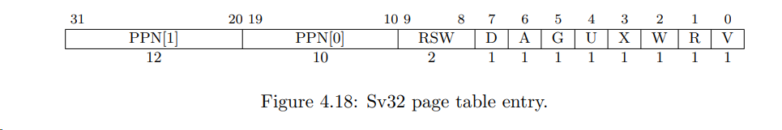
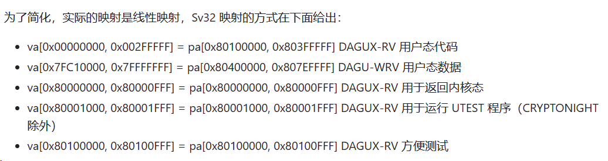
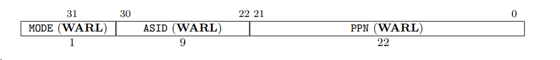

暂时不考虑TLB:

```
SFENCE.VMA  0001001SSSSSsssss000000001110011
```

 SFENCE.VMA 实现为 NOP

实现satp csr寄存器


PTE表项

Sv32: 



V: PTE valid 0 -> 表项无效


实现步骤

1. 编写汇编程序将页表对应关系存入内存



2. 实现 satp csr 寄存器

   satp：地址翻译和内存保护监控寄存器，PPN为root 页表

   

   Mode:1 激活页表 0：关闭